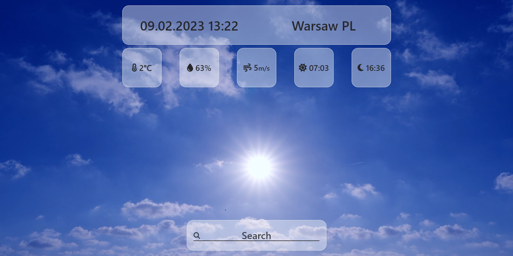
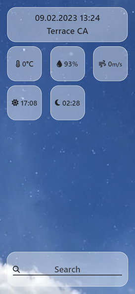

## Live preview - **https://er1v3s.github.io/weather-app**

# Vanilla JavaScript quiz application project

## Available Scripts

In the project directory run scripts:

### `npm start`

### `npm run tailwatch`

(_without the `tailwatch` script, the styles will not be loaded on page_)

Runs the app in the development mode.\
Open [http://localhost:8080](http://localhost:8080) to view it in your browser.

### `npm run build`

Builds the app for production to the `build` folder.\
It correctly bundles files in production mode and optimizes the build for the best performance.
The build is minified and the filenames include the hashes.\

## Gallery

